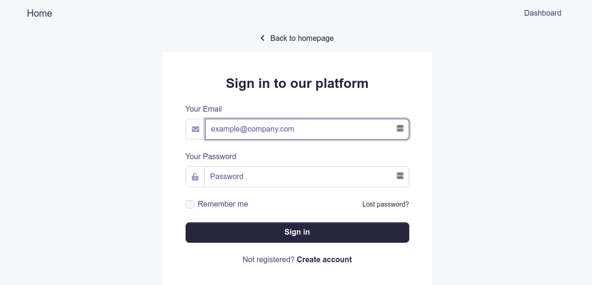
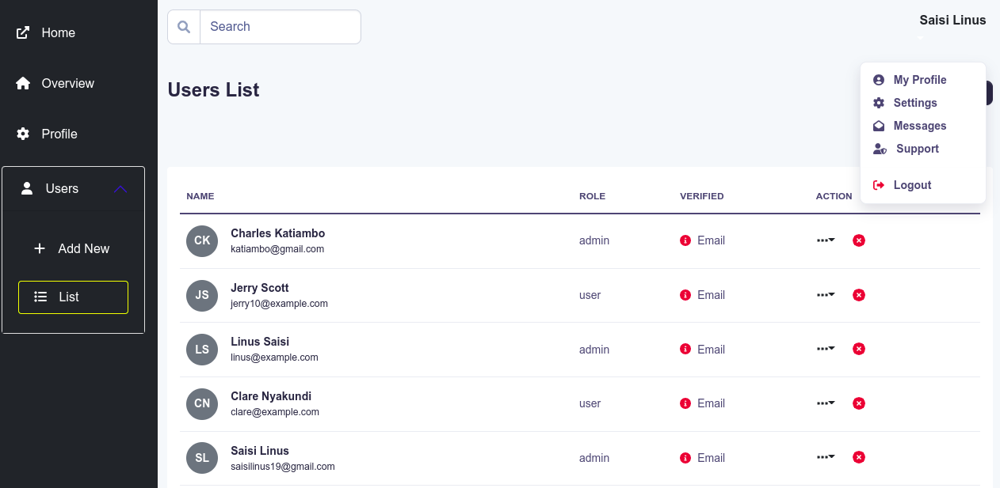

# React Redux Typescript Template

[](https://github.com/saisilinus/react-redux-typescript-boilerplate/actions/workflows/ci.js.yml)
[](https://codecov.io/gh/saisilinus/react-redux-typescript-boilerplate)

This project was bootstrapped with [Create React App](https://github.com/facebook/create-react-app), using the [Redux](https://redux.js.org/) and [Redux Toolkit](https://redux-toolkit.js.org/) template.

This app pairs well with this [node-js express template](https://github.com/saisilinus/node-express-mongoose-typescript-boilerplate)

## Table of Contents

- [Available Scripts](#available-scripts)
- [Learn More](#learn-more)
- [Features](#features)
- [Environment Variables](#environment-variables)
- [Folder Structure](#folder-structure)
- [Authentication](#authentication)
    - [Require Auth](#require-auth)
- [User Management](#user-management)
- [Pagination](#pagination)
- [Animation](#animation)
- [Linting](#linting)
- [License](#license)

## Available Scripts

In the project directory, you can run:

### `yarn start`

Runs the app in the development mode.<br />
Open [http://localhost:3000](http://localhost:3000) to view it in the browser.

The page will reload if you make edits.<br />
You will also see any lint errors in the console.

### `yarn test`

Launches the test runner in the interactive watch mode.<br />
See the section about [running tests](https://facebook.github.io/create-react-app/docs/running-tests) for more information.

### `yarn build`

Builds the app for production to the `build` folder.<br />
It correctly bundles React in production mode and optimizes the build for the best performance.

The build is minified and the filenames include the hashes.<br />
Your app is ready to be deployed!

See the section about [deployment](https://facebook.github.io/create-react-app/docs/deployment) for more information.

### `yarn eject`

**Note: this is a one-way operation. Once you `eject`, you can’t go back!**

If you aren’t satisfied with the build tool and configuration choices, you can `eject` at any time. This command will remove the single build dependency from your project.

Instead, it will copy all the configuration files and the transitive dependencies (webpack, Babel, ESLint, etc) right into your project so you have full control over them. All of the commands except `eject` will still work, but they will point to the copied scripts so you can tweak them. At this point you’re on your own.

You don’t have to ever use `eject`. The curated feature set is suitable for small and middle deployments, and you shouldn’t feel obligated to use this feature. However we understand that this tool wouldn’t be useful if you couldn’t customize it when you are ready for it.

## Learn More

You can learn more in the [Create React App documentation](https://facebook.github.io/create-react-app/docs/getting-started).

To learn React, check out the [React documentation](https://reactjs.org/).

## Features

- **Static Typing**: [TypeScript](https://www.typescriptlang.org/) static typing using typescript
- **Testing**: unit and integration tests using [Jest](https://jestjs.io)
- **State Management**: [Redux Toolkit](https://redux-toolkit.js.org/) state management with redux using redux toolkit
- **Cache Handling**: [RTK Query](https://redux-toolkit.js.org/rtk-query/overview) Cache management using rtk query
- **Notifications**: [react-toastify](https://github.com/fkhadra/react-toastify) awesome toast notifications with react-toastify
- **Styling**: [React Bootstrap](https://react-bootstrap.github.io/) style with bootstrap components via React Bootstrap
- **SASS**: [SASS](https://sass-lang.com/) style more with SASS
- **Animations**: [React Transition Group](https://reactcommunity.org/react-transition-group/) animate using an Animate component created using elements from React Transition Group
- **Pagination**: [React Bootstrap Pagination](https://react-bootstrap.github.io/components/pagination/) paginate with custom component built on React Bootstrap's Pagination
- **Error handling**: [RTK Query Error Handling](https://redux-toolkit.js.org/rtk-query/usage/error-handling) centralized error handling mechanism for fetch requests using rtk query middleware
- **CI**: continuous integration with [GitHub CI](https://travis-ci.org)
- **Code coverage**: using [codecov](https://about.codecov.io/)
- **Git hooks**: with [husky](https://github.com/typicode/husky) and [lint-staged](https://github.com/okonet/lint-staged)
- **Linting**: with [ESLint](https://eslint.org) and [Prettier](https://prettier.io)
- **Changelog Generation**: with [Standard Version](https://github.com/conventional-changelog/standard-version)
- **Structured Commit Messages**: with [Commitizen](https://github.com/commitizen/cz-cli)
- **Commit Linting**: with [CommitLint](https://github.com/conventional-changelog/commitlint)

## Environment Variables
Create your environment variables by copying the `.env.example` file i.e.

```bash
cp .env.example .env.local
```

## Folder Structure

```
src
├── app                             # Redux configuration
│   ├── api.ts                          # base redux API
│   ├── hooks.ts                        # redux hooks
│   ├── middleware.ts                   # redux middleware
│   └── store.ts                        # redux store
├── assets                          # assets
│   └── img
├── custom.d.ts                     # extended custom types
├── index.tsx                       # app entry
├── __mocks__                       # test utils and mocks
│   ├── data.ts
│   ├── server.ts
│   └── utils.tsx
├── modules                         # app modules including pages, components and APIs
│   ├── auth                            # pages, components, tests, and redux API for auth
│   ├── common                          # common components and tests. includes Routing
│   ├── dashboard                       # dashboard pages, components, and tests
│   ├── pages                           # pages
│   └── users                           # pages, components, tests, and redux API for users
├── react-app-env.d.ts
├── serviceWorker.ts
├── setupTests.ts
├── styles                          # styling
│   ├── components                      # component styling e.g. loader
│   ├── _components.scss                # imports
│   ├── custom.scss                     # root styling file
│   ├── layout                          # layout components
│   ├── _layouts.scss                   # imports
│   ├── mixins                          # mixins
│   ├── _mixins.scss                    # imports
│   ├── utilities                       # utilities like transform styles
│   ├── _utilities.scss                 # imports
│   └── _variables.scss                 # custom variables
```

## Authentication

Authentication has already been done for you with the redux-toolkit query API setup. The app was created with APIs from this [node-template](https://github.com/saisilinus/node-express-mongoose-typescript-boilerplate) in mind. 

Pages included in the app include: 
- Login
- Register
- Forgot Password
- Reset Password
- Verify Email



## User Management

Like authentication, user management has already been done for you using rtk query.



### Require Auth

Wrapper for pages that require authentication. Just wrap the route element with RequireAuth and only logged in users with permissions will have access.

```javascript
import { Routes, Route } from 'react-router-dom';
import RequireAuth from './RequireAuth';
import { DashboardHome, Profile } from '../../dashboard';
import restrictions from './restrictions';
import routes from './routes';

const MainRouter = () => {
    return (
        <Routes>
            <Route path={routes.Dashboard.absolutePath}>
                {/* dashboard will be restricted to all logged in users */}
                <Route index element={<RequireAuth element={<DashboardHome />} restrictedTo={restrictions.none} />} />
                {/* profile will be restricted to logged in admin users */}
                <Route
                    path={routes.Profile.relativePath}
                    element={<RequireAuth element={<Profile />} restrictedTo={restrictions.admin} />}
                />
            </Route>
        </Routes>
    );
}

```

As an added bonus: all the navigation items in the dashboard sidebar are also authenticated before being displayed. Define nav items with restrictions e.g.

```javascript
{/* They are automatically restricted to all logged in users*/}
<NavItem
    title="List"
    link={routes.UserList.absolutePath}
    pathname={location.pathname}
    icon={faList}
    restrictedTo={restrictions.admin}
/>
```

## Pagination

Pagination is done using custom logic built on top of [React Bootstrap's Pagination component](https://react-bootstrap.github.io/components/pagination/).

Just wrap your component like so

```javascript
import React, { useState } from 'react';

const [currentPage, setCurrentPage] = useState<number>(1);

const data = fetchSomeData({ page: currentPage });

const onPageClick = (page: number) => {
    setCurrentPage(page);
};

<Paginate currentPage={currentPage} onPageClick={onPageClick} totalPages={data.totalPages}>
    {data.map((item) => (
        <h1 key={item.id}>{item.name}</h1>
    ))}
</Paginate>
```

## Animation
Animate your component using custom css styles and a component built using [React Transition Group](https://reactcommunity.org/react-transition-group/). Animating is as easy as:

```javascript
import Animate from 'blob/components/Animate';

const customComponent = () => {
    return (
        <>
            <Animate>
                <h1>This text will animate</h1>
            </Animate>
        </>
    );
};
```

You can change animation behavior by defining css classes and adding them to the Animate component

## Linting

Linting is done using [ESLint](https://eslint.org/) and [Prettier](https://prettier.io).

In this app, ESLint is configured to follow the [Airbnb JavaScript style guide](https://github.com/airbnb/javascript/tree/master/packages/eslint-config-airbnb-base) with some modifications. It also extends [eslint-config-prettier](https://github.com/prettier/eslint-config-prettier) to turn off all rules that are unnecessary or might conflict with Prettier.

To modify the ESLint configuration, update the `.eslintrc.json` file. To modify the Prettier configuration, update the prettier configuration in `package.json`.

To prevent a certain file or directory from being linted, add it to `.prettierignore`.

## License

[MIT](LICENSE)
